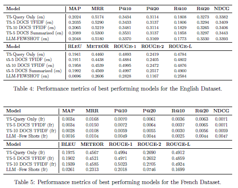

# Enhancing Information Retrieval Through Query Clarification

---

This work aims to address the critical challenge of ambiguous user queries in conversational information retrieval by generating more precise, context-aware prompts. We achieve this by leveraging both the initial ambiguous query and its retrieved documents.

## Our Approach

Our investigation explores two main methods for generating clarification queries:
1.  **Fine-tuning a T5 encoder-decoder model** With varying number of document in entry.
2.  **Employing LLM prompt engineering** With varying prompts. 

Additionally, we explore several document representations and features:
1. **Raw Document representation**
2. **TFIDF Representation** using the top20 tokens from each document.
3. **Topic Representation** using Latent Dirichlet Analysis.
4. **Summarized Representation** using a summarized representation of the document.

## Key Findings

Our findings consistently show that providing **document context** to the **Large Language Model (LLM)** significantly enhances query generation. Specifically, our **Few-Shot prompting strategy** with **TOP5 documents** yielded statistically significantly better results than using an LLM with only the query, for both English and French datasets.

Furthermore, how documents are represented proved important, with **summaries** and **TF-IDF top words** consistently outperforming raw document input and LDA representations. Notably, **document summaries** showed statistically significant improvement in the **Mean Reciprocal Rank (MRR)** metric over the query-only baseline, suggesting their effectiveness in representing the main information of the document.

While not all of our statistical tests were completely conclusive, our results strongly suggest that **leveraging document context is a promising direction** for handling ambiguity and generating effective clarification queries.

## Future Work

Future work should focus on:
* Mitigating information loss from various document representations.
* Exploring more advanced semantic methods, such as **BERTopic** and **word2vec representations**.
* Using more performant models.
* Developing dual solutions that combine both document features and query-specific features (like polysemous words) to further improve clarification capabilities.

## Datasets
[**[Link to Datasets]**](https://drive.google.com/drive/folders/1H38wT871I3oiIgn34Sx57Cc7mnYWGF1r?usp=sharing)

